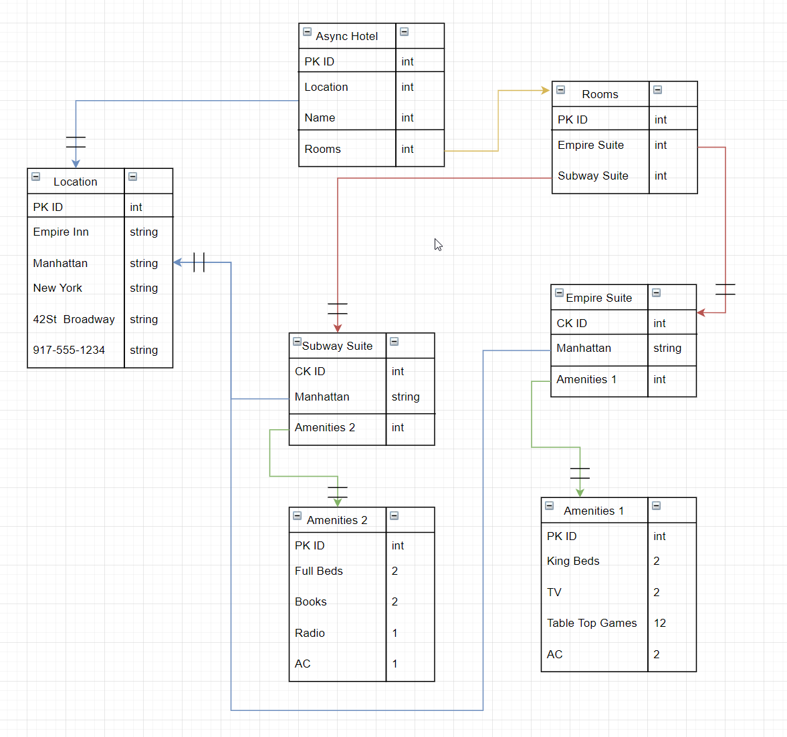

# Async-Inn

## Author
Benjamin Ibarra  

## Colaborators
Steven Boston  
Miriam Silva  
Q Hashi  
Dave Arno  

## Visual

Async Hotel
- Location(grabs info from Location Tabel)
- Name(grabs name from Location Tabel)

Locations  
- Contains Hotel: Name, City, State, Address, Phone Number

Rooms
- List of avaibale rooms at this location
Empire Suite
- City of Room
- Amenties provided with room

Subway Suite
- City of Room
- Amenties provided with room

Amenties 1
- Contains the amenties for this type of room

Amenities 2
- Contains the amenties for this type of room

## Lab-13 - Dependency Injection
Created services for the models, to hand off request tasks from the default methods created by the controller to the services with implemented interfaces for each corresponding model

## Lab-14 - DTO & Routing
Created a basic DTO to filter database table data to be more presentable and establish some navigation properties with in the DTO

## Lab-16 - DTO and Testing
Expanded further with DTO's which help to filter Database table information to be more presentable to a user. Routing of different DTO tables was possible through Navigation properties with in DTO's that would later have linq querys `.Select` made to gather desired data from other data tables.

## Lab-17 - Swagger & Deployment
Integrated Swagger into our api, bypassing the need of using applications like Postman or Insomnia to test REST/CRUD. Deployed API to Azure live on the net, leading to a homepage of the swagger interface

## Lab-18 - Identity
Implemented `Identity Framework`, created DTO's for Login, RegisterUser, and User to filter sensative authentication information. Created an IUser `interface` and IdUserIdentity `service` to handle the registration and login requests, and integrated that serivce into the UsersController where the Post requests are handled  
  
Here is an example of the flow of identity authentication:  
 

